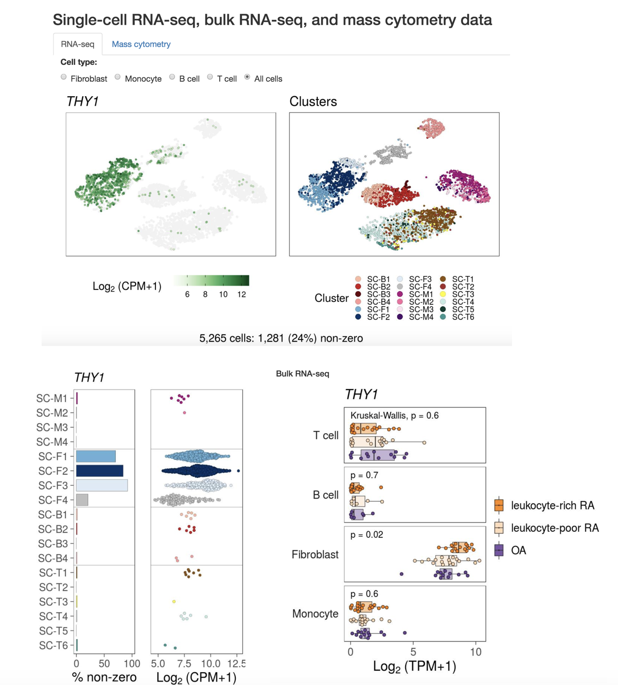

# Use single-cell transcriptomics and proteomics to study Rheumatoid Arthritis (RA) 
*Accelerating Medicines Partnership (AMP) Phase 1*


## Overview
This repo provides the **Data availability**, **Source code**, **Website** for our work on using single-cell transcriptomics and proteomics data to define inflammatory cell states in autoimmune disease - rheumatoid arthritis.

The published paper can be viewed and cited:

> Zhang, F., Wei, K., Slowikowski, K., Fonseka, C.Y., Rao, D.A., et al, 2018. Defining Inflammatory Cell States in Rheumatoid Arthritis Joint Synovial Tissues by Integrating Single-cell Transcriptomics and Mass Cytometry. [Nature Immunology](https://www.nature.com/articles/s41590-019-0378-1), 2019.


## Data availibility

The raw data of this study are available at:

| Database        | Link with accession code     | Data type  |
| ------------- | ------------- | ----- |
| ImmPort      | [SDY998](https://www.immport.org/shared/study/SDY998) | single-cell RNA-seq, mass cytometry, bulk RNA-seq, flow cytometry, clinical and histology |
| dbGAP      | [phs001457.v1.p1](https://www.ncbi.nlm.nih.gov/projects/gap/cgi-bin/study.cgi?study_id=phs001457.v1.p1)   |  single-cell RNA-seq and mass cytometry |


Send us (fanzhang@broadinstitute.org or jmears@broadinstitute.org) an email if you have any quesitons or requests for data download.

## Source code 

#### Clone this repo:

```bash
cd ~/work/
git clone git@github.com:immunogenomics/amp_phase1_ra.git
cd amp_phase1_ra
```

#### Download the data from internal server:
`rsync -avh rgs04:/data/srlab/public/srcollab/AMP/amp_phase1_ra/data`


#### Structure

The files in the repo are organized as follows:

    .
    ├── R
    |── data

`data/` has Excel sheets with sample metadata and RData files with processed data ready for analysis.

`R/` has code for analysis and creating figures:

+ Classify tissue samples using Mahalanobis distance: `R/optimal_lymphocyte_threshold.R`

+ Integrate bulk with single-cell RNA-seq: `R/scRNAseq_bulkRNAseq_integrative_pipeline.R`

+ Cluster and disease association test using mass cytometry: `R/Tcell.SNE.densVM.server.R`, `R/Tcell.MASC.R`

+ Identify cluster marker genes: `R/cluster_marker_table.R`, `R/limma_differential_bulk.R`

+ Functions for PCA, densisty analysis, etc: `R/pure_functioins.R`

+ Visualize results: `R/cytof_results_plot.R`, `plot_cluster_markers.R`, etc
 
+ More

Send us (fanzhang@broadinstitute.org) an email if you have any quesitons for the analysis.


## Website 

Feel free to check out the  websites and search your favorite genes:
 
1. [Shiny app](https://immunogenomics.io/ampra/): view single-cell RNA-seq, bulk RNA-seq, and mass cytometry data for rheumatoid arthritis data.
2. [UCSC Cell Browser](https://immunogenomics.io/cellbrowser/): view single-cell RNA-seq datasets: 1 rheumatoid arthritis dataset and 2 lupus datasets.
3. [Broad Institue Single Cell Portal](https://portals.broadinstitute.org/single_cell/study/amp-phase-1): view single-cell RNA-seq datasets: 1 rheumatoid arthritis datset and 2 lupus datasets. 

For example, get everyting in one page using [Shiny app](https://immunogenomics.io/ampra/):



Send us (kslowikowski@gmail.com, jmears@broadinstitute.org, or fanzhang@broadinstitute.org) an email if you have any quesitons for the websites. 
